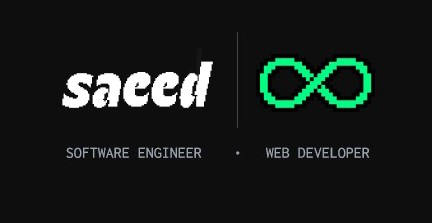

  

<h1 align="center">Hi 👋, I'm Saeed Mohamed</h1>
    

        

            <strong>
                Computer Science Student, Back-End Engineer, and a Problem Solver.  
                Detailed-oriented, responsible, and committed engineer, with a get-it-done, on-time, and high-quality product spirit. Self and quick learner, self-motivated, and social.
            </strong>
        

    

- 🌱 I’m currently learning DevOps via **DEPI**

- ⚡Good in Algorithms, Data Structures, Database Systems, Object-Oriented Programming, and Design Patterns.

- 👨‍💻 All of my projects are available at [https://sae8d.vercel.app/](https://sae8d.vercel.app/)

- 📝 I regularly write articles on [https://sae8d.vercel.app/blog](https://sae8d.vercel.app/blog)

- 📄 Know about my experiences [https://drive.google.com/file/d/1jhE2vkaDASqFhjzTjLwDdrngcdNcSmas/view](https://drive.google.com/file/d/1jhE2vkaDASqFhjzTjLwDdrngcdNcSmas/view)

#

<h3 align="left">Connect with me:</h3>

#
<h3 align="left">Tech:</h3>

  
  
  
  
  
  
  
  
  
  
  
  
  
  
  
  
  
  
  
  
  
  
  

#

